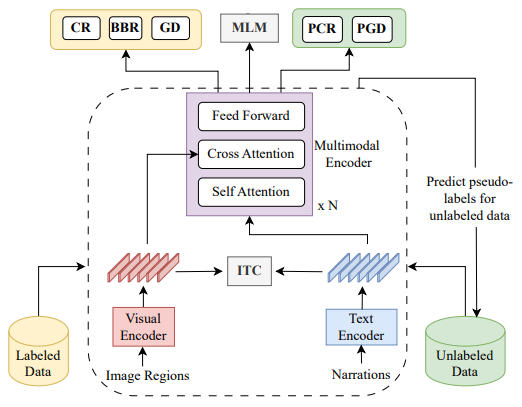

# Semi-supervised multimodal coreference resolution in image narrations, EMNLP 2023
In this paper, we study multimodal coreference resolution, specifically where a longer descriptive text, i.e., a narration is paired with an image. This poses significant challenges due to fine-grained image-text alignment, inherent ambiguity present in narrative language, and unavailability of large annotated training sets. To tackle these challenges, we present a data efficient semi-supervised approach that utilizes image-narration pairs to resolve coreferences and narrative grounding in a multimodal context. 

<p align="center">
  
</p>

> [**Semi-supervised multimodal coreference resolution in image narrations**](https://arxiv.org/pdf/2310.13619.pdf),            
> Arushi Goel, Basura Fernando, Frank Keller, Hakan Bilen,        
> *EMNLP 2023 ([arXiv](https://arxiv.org/pdf/2310.13619.pdf))*  
>
> [**Who are you referring to? Coreference resolution in image narrations**](https://openaccess.thecvf.com/content/ICCV2023/papers/Goel_Who_Are_You_Referring_To_Coreference_Resolution_In_Image_Narrations_ICCV_2023_paper.pdf),            
> Arushi Goel, Basura Fernando, Frank Keller, Hakan Bilen,        
> *ICCV 2023 ([CVF](https://openaccess.thecvf.com/content/ICCV2023/papers/Goel_Who_Are_You_Referring_To_Coreference_Resolution_In_Image_Narrations_ICCV_2023_paper.pdf))*  


## Dependencies
This code requires the following:
* Python 3.7 or greater
* PyTorch 1.8 or greater

## Environment installation 
```bash
conda create -n mcr python=3.8
conda activate mcr

conda install pytorch==1.8.0 torchvision==0.9.0 torchaudio==0.8.0 cudatoolkit=10.2 -c pytorch

pip install transformers==4.11.3
pip install spacy==3.4.1
pip install numpy==1.23.3
pip install spacy-transformers
python -m spacy download en_core_web_sm
pip install h5py
pip install scipy
pip install sense2vec
pip install scorch
```

## Prepare dataset

Create a folder `datasets/`.

Download the CIN annotations from [here](https://drive.google.com/drive/folders/1RId8PI3KKMKVPE4vuCBFU1ugZI_wfe7m?usp=sharing). This will create a folder `cin_annotations` inside the `datasets` folder.

Download the Localized narrative caption vocabulary `flk30k_LN.json` [json file](https://drive.google.com/file/d/1D_E6tnqBeYlnBfD_rHGEAHyD1Bj7VXt5/view?usp=sharing) to `datasets/`.  

Download the Localized narrative captions `flk30k_LN_label.h5` [hdf5 file](https://drive.google.com/file/d/1pBVPpgMTAerQY5Sq_JMrUOGJMhaYPbG0/view?usp=sharing) to `datasets/`.

Download [train_features_compress.hdf5](https://drive.google.com/file/d/1ABnF0SZMf6pOAC89LJXbXZLMW1X86O96/view?usp=sharing)(6GB), [val features_compress.hdf5](https://drive.google.com/file/d/1iK-yz6PHwRuAciRW1vGkg9Bkj-aBE8yJ/view?usp=sharing), and [test features_compress.hdf5](https://drive.google.com/file/d/1pjntkbr20l2MiUBVQLVV6rQNWpXQymFs/view?usp=sharing) to `datasets/faster_rcnn_image_features`.


Download [train_detection_dict.json](https://drive.google.com/file/d/1_S-zyKF7F8SIEht6V66Sqbsz9TBqzY-P/view?usp=sharing), [val_detection_dict.json](https://drive.google.com/file/d/1KmyG0mghwydkb7pEwxDjItwZvNi_DRA4/view?usp=sharing), and [test_detection_dict.json](https://drive.google.com/file/d/1-r4u45EyxY7uaIk6VxCZxCiBxaOlaTC2/view?usp=sharing) to `datasets/faster_rcnn_image_features`.

Download [train_imgid2idx.pkl](https://drive.google.com/file/d/1n9AobA8u6hk_MSs7o3bl-IImsE45A1kV/view?usp=sharing), [val_imgid2idx.pkl](https://drive.google.com/file/d/1A3vXqIfbOj837WS7AUih50rSPmTqZwrn/view?usp=sharing), and [test_imgid2idx.pkl](https://drive.google.com/file/d/1ziEExW2XB_Ru6ctLI8KLHOQOjBFUVfMl/view?usp=sharing)  to `datasets/faster_rcnn_image_features`.

(Optional) Download the processed mouse traces `flk30k_LN_trace_box` for the flickr30k localized narrative captions from [here](https://drive.google.com/file/d/17m7Y9TV1K3erMPJGbIIGSF1SBuc2OBbn/view?usp=sharing) 

## Training script 

To save the models create a folder `saved/final_model` and then run the training script below for the final model.

```
CUDA_VISIBLE_DEVICES=1,2,3,4 python -m torch.distributed.launch --master_port 10006 --nproc_per_node=4 --use_env main.py --use-ema --use-ssl --model_config configs/mcr_config.json --batch 6 --ssl_loss con --label-prop --bbox-reg --grounding --save_name final_model/
```

## Evaluation script 

### For coreference resolution 
This test script will save the predicted coreference chains in the folder `coref/modelrefs/test`. Create this directory prior to running the script.

```
CUDA_VISIBLE_DEVICES=0 python -m torch.distributed.launch --master_port 10003 --nproc_per_node=1 --use_env test_coref.py  --bbox-reg --use-phrase-mask --model_config configs/mcr_config.json --save_name saved/final_model/models_17.pt
```

Run the scorch script below to calculate CR metrics.

### For narrative grounding

```
CUDA_VISIBLE_DEVICES=5 python -m torch.distributed.launch --master_port 10003 --nproc_per_node=1 --use_env test_grounding.py  --bbox-reg --use-phrase-mask --model_config configs/mcr_config.json --save_name saved/final_model/models_17.pt
```

## Prepare ground truth coreference annotations

Download the ground truth coreference chains from [here](https://drive.google.com/file/d/1ZnEBvMelAYcxXF_wA48ReBnAmZjpE_A7/view?usp=sharing). Unzip the `gold.zip` file to a folder named `coref/`.


## Calculate metrics using scorch

```
scorch coref/gold_count/test/ coref/modelrefs/test/
```

## Contact 

Please contact the first author for any queries or concerns at [goel.arushi@gmail.com](goel.arushi@gmail.com).